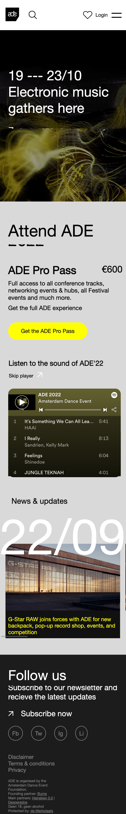

# Procesverslag
Markdown is een simpele manier om HTML te schrijven.  
Markdown cheat cheet: [Hulp bij het schrijven van Markdown](https://github.com/adam-p/markdown-here/wiki/Markdown-Cheatsheet).

Nb. De standaardstructuur en de spartaanse opmaak van de README.md zijn helemaal prima. Het gaat om de inhoud van je procesverslag. Besteed de tijd voor pracht en praal aan je website.

Nb. Door *open* toe te voegen aan een *details* element kun je deze standaard open zetten. Fijn om dat steeds voor de relevante stuk(ken) te doen.

## Jij

  
Kick-Off

  ### Auteur:
  Elaine Wilberforce

  #### Je startniveau:
  Rood

  #### Je focus:
  Surface plane

## Je website

  
De opdracht

  ### Je opdracht:
  Amsterdam Dance Event
  https://www.amsterdam-dance-event.nl/en/
  https://www.amsterdam-dance-event.nl/en/program/

  #### Screenshot(s) van de eerste pagina (small screen): 
  Amsterdam Dance Event

  

  #### Screenshot(s) van de tweede pagina (small screen):
  ADE 2022 Program - ADE 

  
 

## Toegankelijkheidstest 1/2 (week 1)

  
Week 1

  ### Bevindingen

  #### Screenreader
  Ik heb VoiceOver van Apple gebruikt om de toegankelijkheid van mijn site uit te testen. Bij de screenreader heb ik de volgende bevindingen gevonden:
  - Sommige koppen zijn niet samengevoegd
  - Knop voor de video’s spreekt hij alleen uit als knop
  - Links voor de social media spreekt ie alleen uit als afkortingen (instagram als Ig) 
   - Navigatie in footer leest hij omgekeerd
  - Kopniveau 2: see something you like? Staat nergens op
  - Hartje (favorieten) leest hij als plus
  - Gedoe met de search balk
 
  Dit kan ik oplossen door de teksten wat duidelijker te maken en typen, de buttons en om de regels in de goede volgorde te coderen.

  #### Muis en Toetsenbord 
  ///

  #### Motoriek (shocks, elastiekjes)
  Ik heb daarna de motorieke functies getest met een elektrische schokapparaat om Parkinsons na te bootsen en elastiekjes om je vingers voor beperkingen aan je vingers.

  Ik kwam niet heel ver met het elektrische apparaat omdat dit te heftig voor mij was maar ik heb wel wat getest met de elastiekjes, zoals typen, scrollen en klikken. Het typen ging wel alleen had ik veel typfouten

  Voor het bijvoorbeeld typen in een form kan ik suggesties toevoegen zodat er minder getypt hoeft te worden.

  

  #### Visueel (brillen, contrast, kleurenblind, dark/light). 
  Ik heb de brillen getest (met zeer beperkt zicht en wazig zicht) en ben door mijn site gaan scrollen en wat ik heb opgemerkt is dat de kleine tekstjes moeilijk te lezen zijn doordat het wazig te zien is. Ook is de tekst van de footer niet handig met het contrast (zwarte achtergrond met grijze tekst).

  Ik kan dit bijvoorbeeld oplossen door een hoger contrast te gebruiken als kleur, fellere kleuren te gebruiken en wat groter tekst/duidelijkere lettertype te gebruiken

  

## Breakdownschets (week 1)

  
Mijn 3 breakdownschetsen van mijn website

  ### pagina 1 - ADE programma (content verandert elke dag): 
  

  ### dynamisch deel (menu): 
  

  ### pagina 2 - ADE homepagina (content verandert elke dag):
  

## Voortgang 1 (week 2)

  
1e Voortgangsgesprek

  ### Stand van zaken
  
  

  Ik was best ver met mijn code, ik heb de eerste media geplaatst, met de verschillende sections. Alleen had ik wat problemen met de position:fixed op mijn kopjes bovenop de video background wat het responsiveness wat lelijk maakte.

  ### Agenda voor meeting
  samen met je groepje opstellen

  | Elaine            | Shelley            | Lisanne      | Karenza             |
  | ---               | ---                | ---          | ---                 |
  | position: fixed   | verplaatsen        | nog werken   | geen vragen         |
  | hamburger menu    | container css      | aan html     |                     |
  | ...               | hamburger menu     | ...          | ...                 |

  ### Verslag van meeting
  Het gaat dus goed (en zo doorgaan). Alleen kleine puntjes aanpassen zoals:

  - h1 maar 1x gebruiken in je hele html + kopjes altijd eerst
  - aria-labels gebruiken voor accesibility en screenreaders
  - Hamburger menu handigheden met JS
  

## Voortgang 2 (week 3)

  
2e Voortgangsgesprek

  ### Stand van zaken
  Ik heb verder gewerkt aan code en een 2e HTML pagina aangemaakt (maar nog geen content erin). Ik wilde een carousel maken net als op de ADE website, met dat de datum van het kopje zou veranderen als je bij een bepaalde slide bent. Verder heb ik gewerkt met grids, had ik vragen over de button van mijn menu en ben ik gaan nadenken over hoe ik de search gedeelte van mijn site zou vormgeven.

  
  

  ### Agenda voor meeting
  samen met je groepje opstellen

  | Elaine              | Shelley              | Lisanne        | Karenza          |
  | ---                 | ---                  | ---            | ---              |
  | button              | positie "child" in   | nog werken     | geen vragen      |
  | verplaatsen in      | grid zonder dat hij  | aan html/css   |                  |
  | hamburgermenu open  | uittrekt + css check | ...            | ...              |

  ### Verslag van meeting
  Heel tevreden met mijn voortgang en code
  Yara heeft mij Intersection Observer aangeraden om de kopjes met de slides te laten veranderen

  - Intersection Observer
  - Veel comments handig in code
  - Verder niet echt veel te zeggen html opbouw was goed en heb ik verder verbeterd

## Toegankelijkheidstest 2/2 (week 4)

  
Toegankelijkheidstest

  ### Bevindingen
  Lijst met je bevindingen die in de test naar voren kwamen (geef ook aan wat er verbeterd is): nog uitwerken + foto's toevoegen

  #### Screenreader
  Ik heb opnieuw de screenreader van VoiceOver gebruikt om te testen. 
  Dit zijn de resultaten:

  Screenreader:
  - Issues met skip button spotify
  - Carousel leest ie niet als link
  - Afbeeldingen alt niet toegevoegd, leest als file
  - Heading laatste carousel (niet opnieuw lezen?)

  

  - Headings leest ie wel
  - P's leest ie wel
  - Navigatie gaat goed
  - A's gaat goed

  Zoals je hier kan zien heb ik een paar dingen niet toegevoegd, zoals de alt op afbeeldingen waardoor hij de hele file name leest. Ook zijn er problemen met mijn skip button, en leest hij natuurlijk de header van mijn carousel niet, omdat dat visueel is vormgegeven. Dit kan ik oplossen door in de alt van de carousel images de datum toe te voegen zodat de screenreader leest wat voor datum het is.

  #### Muis en Toetsenbord 
  Focus en hover state nog niet gedaan, omdat ik ze niet heb toegepast. Wel heb ik de visuele test gedaan en kan ik uit de feedback hiervan een focus of hover state maken dat duidelijk te zien is

  #### Motoriek (shocks, elastiekjes)
  De motorieke test heb ik niet gedaan omdat ik uit voorkeur geen shockapparaat op wilde zetten.

  #### Visueel (brillen, contrast, kleurenblind, dark/light). 
  Ik heb de Chrome plugin Colorblindly gebruikt om kleurenblindheid te testen, en heb brillen uitgetest. 
  
  
  
  Dit zijn de resultaten:

  - Kleurenblindheid - 
  Normaal - oke, tekst in carousel is nog meh

  Blue cone
  Problemen met tekst in carousel gele tekst (laatste section)

  Monochrome 
  Problemen met tekst in carousel gele tekst (laatste section) 
  Pijltjes zwart, misschien border eromheen.

  Green-weak
  Oke

  Green-blind
  Oke

  Red-weak
  Oke

  Red-blind
  Oke

  Blue weak
  Problemen met tekst in carousel gele tekst (laatste section)

  Blue-blind
  Problemen met tekst in carousel gele tekst (laatste section)

  - Brillen - 

  Low contrast
  Tekst carousel geel niet duidelijk
  Footer tekst wat helderder

  Color
  Alles gaat goed

  Hemifield loss
  Oke

  Central field loss
  Wazig zien, misschien meer contrast

  Diabetic eye disease
  - 

Wat er vooral uitkwam is dat de contrast in het algemeen goed te zien is voor alle kleurenblinden, maar er hier en daar nog wat tekst is (zoals de p in mijn carousel op 1e pagina), waar het echt slecht te zien is. Ik kan dit fixen door dit in een hover te veranderen en een zwarte achtergrind toe te voegen voor betere kleur en leesbaarheid

## Voortgang 3 (week 4)

  
3e Voortgangsgesprek

  ### Stand van zaken
  Mijn pagina's zijn voor 90% af, alle content (behalve 1 section) zit erin. Ik heb gevraagd of ik een class mocht gebruiken voor het scheiden van de styling tussen de 2 pagina's en dat mocht. In mijn CSS heb het gebruik daarvan alleen beperkt tot sections die andere styling hebben (ik heb een paar die dezelfde hebben en de code kan ik hiervoor hergebruiken). 

  Ook een klein dingetje met mijn intersection observer carousel waardoor hij alles in 1x las ipv gewoon te kijken welke slide er observeerd werd wat heel klein is maar wel "noticable" dus ik heb hulp gekregen van Sanne
  

  
  
  
  

  ### Agenda voor meeting
  samen met je groepje opstellen

  | Elaine           | Shelley                 | Lisanne      | Karenza             |
  | hoe linken       | toestemming div/class   | gestopt      | Extra flexbox &     |
  | naar section     | voor carousel           | -            | CSS uitleg en       |
  | zonder id/class  | productpagina           | ...          | fonts               |

  ### Verslag van meeting
  Gaat goed komen, verder niet veel te zeggen maar wel paar puntjes

  - Opletten met contrast tekst carousel intersection observer
  - Opletten met contrast tekst hover "recent artists" section op pagina 2
  - Ik mag class gebruiken voor het skippen naar section voor het skippen van 60+ spotify liedjes

    ### Voor mezelf
  - Als ik nog tijd heb alle websites responsive maken (375px min, 560px min)
  - content nog aanvullen in pagina Program
  - Deze markdown aanvullen + bronnen niet vergeten
  - menu niet vergeten
  - labels ook

## Eindgesprek (week 5)

  
Eindgesprek

  ### Je uitkomst - karakteristiek screenshots:
  
  560px">

  
  560px">

  ### Dit ging goed/Heb ik geleerd: 
  
  - Intersection observer
  Dit vond ik leuk om te doen want het is JavaScript

  - De nth gebeuren
  Ik heb geleerd hoe je naar onderdelen in je HTML kan linken zonder daarop een class of id te zetten, door de nth selectoren te gebruiken en te weten wat nou je children en parents zijn. Dat kleine spelletje met het css selectoren en eten op plates heeft veel geholpen

  - Grids
  Ik heb geleerd om een grid te maken dit heb ik vorig jaar niet gedaan omdat ik het niet snapte, maar het is best simpel, je moet alleen een beetje uittekenen waar je je content wil, and that's it

  - Positioneren
  Ik weet nu een beetje het verschil tussen alle positions

  - Aria labels en meer accesibility
  Ik heb geleerd wat een aria label is en hoe zo een klein labeltje een groot verschil maakt voor mensen die websites browsen met een screenreader

  - Screenreader en andere testen
  Ik heb geleerd hoe je VoiceOver gebruikt. Dit is handig voor als je je accesibility wilt testen dus dit zal ik vaker gebruiken voor tests. Ook handig om te zien hoe kleurenblinden mijn site zien en voortaan zal ik ontwerpen met de gedachte dat zij ook mijn website browsen

  - Good practice met veel comments zetten zodat je overzicht hebt in je code

  - Custom properties in je css, dit is handig want je hebt overzicht van je kleuren en je kan kleurenpaletten maken

  
  Hier een stukje code waar je dus ziet dat ik verschillende a's style maar ze wel direct selecteer
  
  En de eindresultaat ervan.

  ### Dit was lastig/Is niet gelukt:
  Alles is gelukt maar ik vond mijn navigatie maken een klein beetje lastig omdat ik 2 soorten hamburgermenu's heb, 1 voor mijn menu en 1 voor het openklappen voor search. Dit heb ik uiteindelijk wel opgelost door een beetje te spelen met de nth's en direct child selectoren dus het kwam wel gewoon goed. Ook heb ik direct de linkjes moeten selecteren om de inhoud in het hamburgermenu (gewone menu) te vormgeven

  
  Heel veel specificeren..
  
  Maar het is gelukt!

## Bronnenlijst

  
continu bijhouden terwijl je werkt

  Nb. Wees specifiek ('css-tricks' als bron is bijv. niet specifiek genoeg).

  1. Intersection Observer - https://developer.mozilla.org/en-US/docs/Web/API/Intersection_Observer_API
  2. Carousel van Sanne - https://codepen.io/shooft/pen/abmLRMg
  3. Learn Intersection Observer in 15 minutes - https://www.youtube.com/watch?v=2IbRtjez6ag
  4. The Noun Project - Icons - https://thenounproject.com/
  5. Media van ADE - https://www.amsterdam-dance-event.nl/en/
  6. Base64 Decoder (voor a::before icon converteren naar SVG) - https://base64.guru/converter/decode/file
  7. Scroll to top button - https://www.w3schools.com/howto/howto_js_scroll_to_top.asp
  8. Embedded Spotify link - https://open.spotify.com/playlist/2tYOFz9ouZnhV833UixJI8?go=1&utm_source=embed_player_m&utm_medium=desktop&nd=1 

